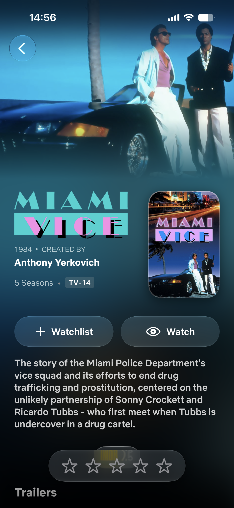
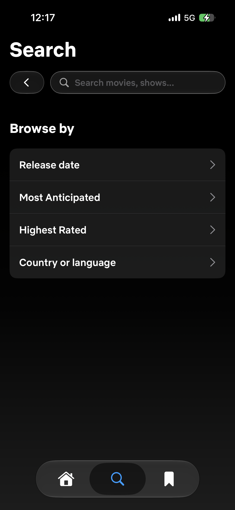

# WatchMan 🍿

A highly concurrent, beautifully designed iOS application built entirely with **SwiftUI** and modern **Swift Concurrency** (`async`/`await`). WatchMan is designed for movie and television enthusiasts, serving as a hub to discover new content, sync data from Letterboxd, and generate deep algorithmic taste profiles.

<p align="center">
  
  
  
</p>

## ✨ Core Features

- **Immersive Cinematic UI:** Custom glassmorphism, dynamic background blur extraction, rim-lighting effects, and fluid scroll-driven view transitions natively built in SwiftUI.
- **Letterboxd Sync Engine:** A custom built asynchronous scraper that authenticates and syncs a user's Letterboxd diary, ratings, and watchlist directly into local storage.
- **Advanced Algorithmic Discovery:** Dynamic mapping of movies and shows to custom curated categories using Vibe Clusters, Release Decades, and highly granular TMDB parameter querying.
- **Multi-Source Aggregation:** Pulls foundational data from TMDB, aggregates critical ratings via OMDB (IMDb/Metacritic), and scrapes Letterboxd/Rotten Tomatoes on the fly for community consensus.
- **Local Persistence & Taste Profiling:** Generates real-time taste profiles by analyzing locally stored viewing history, calculating affinities for specific actors, directors, genres, and decades.

<p align="center">
  
  
  
</p>

---

## 🛠 Technical Architecture Deep Dive

WatchMan follows a strict **Model-View-ViewModel (MVVM)** architecture, emphasizing separation of concerns, strict type-safety, and robust state management leveraging iOS 17's `@Observable` macro alongside `@MainActor` thread safety.

### 1. Concurrency & Networking Model
The networking layer is engineered for extreme parallelism to populate complex UI grids instantly. Traditional iOS apps load screens sequentially, leading to frustrating loading spinners. WatchMan sidesteps this entirely via Swift Structured Concurrency.

- **Parallel Fetching (`async let` & `TaskGroup`):** 
  The global `ViewModel.swift` leverages `async let` extensively to execute up to 20+ API calls concurrently during app launch. When the `HomeView` loads, it simultaneously fetches Trending Movies, Trending TV, In-Theatres, Upcoming, Popular, and customized Vibe Clusters without blocking the main thread.
- **Custom `URLSession` Tuning:** 
  To prevent TCP connection bottlenecks—which traditionally limit iOS to 6 connections per host and cause 60-second timeouts on heavy parallel loads—individual API clients (`DataFetcher`, `TMDBClient`, `OMDBClient`, `RottenTomatoesClient`) instantiate custom `URLSession` instances:
  ```swift
  let config = URLSessionConfiguration.default
  config.timeoutIntervalForRequest = 15 // Fails fast on network drop
  config.timeoutIntervalForResource = 30
  config.httpMaximumConnectionsPerHost = 40 // Aggressive concurrent connections
  return URLSession(configuration: config)
  ```
- **Combine-Driven Image Pipeline:** 
  `ImageLoader.swift` utilizes Combine (`dataTaskPublisher`) coupled with `NSCache` to effortlessly stream, memory-cache, and render hundreds of high-resolution TMDB posters concurrently. State publishers immediately notify SwiftUI to animate the transition from a placeholder to the downloaded image.

### 2. State Management & Data Flow
State management is handled through a hybrid approach utilizing the new Observation framework and environment injection.

- **`@Observable ViewModel`:** The primary source of truth, managing lists of `Title` objects (Trending, Popular, Anticipated). It implements a robust state machine via the `FetchStatus` enum (`.notStarted`, `.fetching`, `.success`, `.failed`), allowing views to automatically swap between skeletons, data, and error states.
- **`DetailViewModel`:** A contextual model spun up for individual `TitleDetailView` pages. It handles deep-dives into single items, resolving YouTube trailer IDs, aggregating cast, and fetching bespoke recommendations.

### 3. SwiftData Persistence & Local Storage
Rather than relying on `UserDefaults` or standard `FileManager` serialization, WatchMan utilizes Apple's modern **SwiftData** framework for high-performance disk storage.

- **`UserLibraryManager`:** An `@ObservableObject` that wraps a `ModelContext`. It is responsible for injecting, fetching, and mutating `UserLibraryItem` models. 
- **Query Descriptors:** Fast fetching is achieved via `FetchDescriptor<UserLibraryItem>` utilizing `#Predicate` macros to securely resolve items by their `titleId` and `mediaType` directly against the local SQLite layer.

### 4. The Recommendation Engine
At the heart of the "Library" and "Taste Profile" tab is the `RecommendationEngine.swift`. Rather than relying on simple "More Like This" endpoints, WatchMan builds a mathematical profile of your tastes.

- **Taste Seeds & Fingerprinting:**
  The engine iterates over your `UserLibraryItem` SwiftData models and assigns weights (`TasteSeed`) to titles based on your ratings (e.g., 5-star ratings yield a high positive weight, negative ratings yield negative weights). 
- **Microgenre Rules:**
  The app defines custom `MicrogenreRule` structs (e.g., "90s Sci-Fi Thrillers", "High-Rated Arthouse Drama"). The engine matches your highly-weighted genres, preferred decades, and favorite directors against these rules to dynamically query TMDB's advanced discovery endpoint.
- **Result Culling:**
  Results are deduplicated and mapped to localized UI clusters (`RecommendationSection`), generating completely unique carousels based on a unique fingerprint (a hash of your library contents).

### 5. Service Integrations & Web Scraping
While TMDB acts as the primary data backbone (via `TitleDTO`), WatchMan aggregates external sentiment to provide a complete picture.

- **`LetterboxdSyncClient` (Headless Scraping):** 
  Since Letterboxd lacks a public API, WatchMan implements an asynchronous HTML parsing engine in Swift. It traverses user profiles, iterates through paginated diary pages, parses specific HTML nodes for film identifiers and star ratings, and cross-references them via TMDB IDs.
- **`OMDBClient` & `RottenTomatoesClient`:** Leveraged specifically for fetching detailed critic ratings (IMDb, Metacritic, Rotten Tomatoes scores) via lightweight GET requests, bringing aggregated critical consensus directly into the native UI.

<p align="center">
  
  
</p>

### 6. SwiftUI Design System & UI Architecture
The visual aesthetic of WatchMan is driven by a bespoke internal design system optimized for cinema tracking.

- **Glassmorphism & Rim Lighting:**
  Through custom View Modifiers (e.g., `ContentView+RimLight.swift`), the app injects subtle specular highlights and ultra-thin borders around navigation bars and modal sheets to mimic physical glass over a cinematic background.
- **Dynamic Blur Extraction:**
  The `TMDBImage` component dynamically extracts primary colors from loaded posters and projects them as ultra-blurred background ambient lights (`.blur(radius: 80)`), creating a TV-like halo effect behind content.
- **Fluid View Transitions:**
  The `CardScrollTransitionView` leverages iOS 17's `scrollTransition` API to dynamically scale, fade, and rotate poster cards as they enter and exit the `ScrollView` viewport.
- **Localized Components:** The UI relies on highly modular structs like `PosterCard`, `FloatingRatingPill`, and `RatingSheet` to maintain consistency across the app while keeping individual view files (like `HomeView.swift` and `LibraryView.swift`) strictly declarative.

---

## 📂 Project Structure

```text
watchman/
├── WatchManApp.swift          # App entry point & Environment injection
├── APIConfig.swift / .json    # Endpoint & credential configurations
├── ViewModel.swift            # Core global application state (@Observable, @MainActor)
├── DetailViewModel.swift      # Contextual state for Movie/TV details
├── Models/                    # DTOs, Enums, and Swift Data structures (TitleDTO, Person, etc.)
├── Views/                     # Feature-specific UI screens
│   ├── HomeView.swift         # Dynamic entry feed
│   ├── TitleDetailView.swift  # Rich media page
│   ├── SearchResultsView.swift# Complex filtering grids
│   ├── TasteProfileView.swift # Analytics & personalized stats
│   └── LibraryView.swift      # Local SwiftData persistence hub
├── Components/                # Reusable UI elements (PosterCard, RatingSheet, TMDBImage)
├── DesignSystem/              # Shared modifiers, styles, and typography (RimLight)
├── Utilities/                 # Helper classes & Extensions
│   ├── ImageLoader.swift      # Combine-powered async image fetching
│   └── UserLibraryManager.swift # SwiftData disk persistence logic
└── TMDBClient.swift           # Core networking clients (OMDB, Letterboxd, etc.)
```

---

## 🚀 Getting Started

### Prerequisites
- **Xcode 15.0+**
- **iOS 17.0+** SDK (Strict requirement for advanced SwiftUI scroll transitions and `@Observable`).
- Valid API Keys for **TMDB**, **OMDB**, and **YouTube Data API v3**.

### Installation & Setup

1. **Clone the repository**
   ```bash
   git clone https://github.com/yourusername/WatchMan.git
   cd WatchMan
   ```

2. **Configure Environment / API Keys**
   The app reads from `APIConfig.json` at runtime. Open the file and inject your production keys. Do **not** commit this file if your repository is public.
   ```json
   {
       "tmdbBaseURL": "https://api.themoviedb.org",
       "tmdbAPIKey": "YOUR_TMDB_API_KEY",
       "omdbBaseURL": "https://www.omdbapi.com",
       "omdbAPIKey": "YOUR_OMDB_API_KEY",
       "youtubeBaseURL": "https://youtube.com/embed",
       "youtubeAPIKey": "YOUR_YOUTUBE_API_KEY",
       "youtubeSearchURL": "https://www.googleapis.com/youtube/v3/search"
   }
   ```

3. **Build and Run**
   Open the root folder or `.xcodeproj` in Xcode. Wait for Swift Package Manager (if any dependencies exist) to resolve. Select your target device/simulator and press `Cmd + R` to compile.

## 🤝 Contributing
For major architectural changes, please open an issue first to discuss the proposed modifications. We adhere to strict separation of concerns and favor protocol-oriented design.

## 📄 License
This project is licensed under the MIT License.
